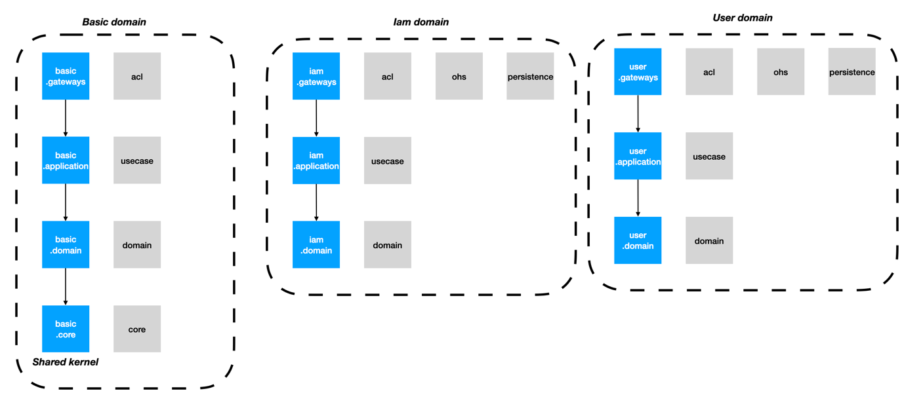
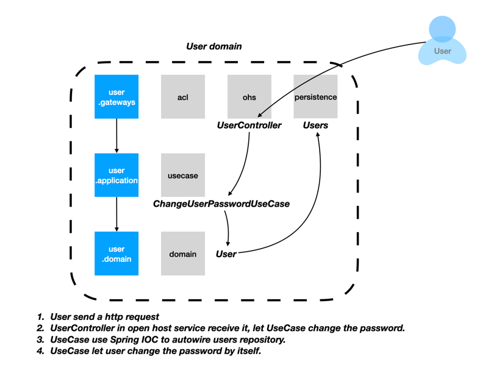
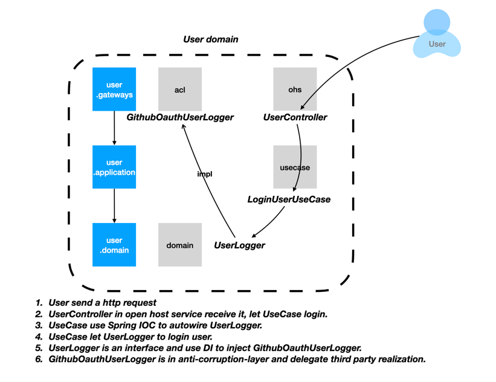
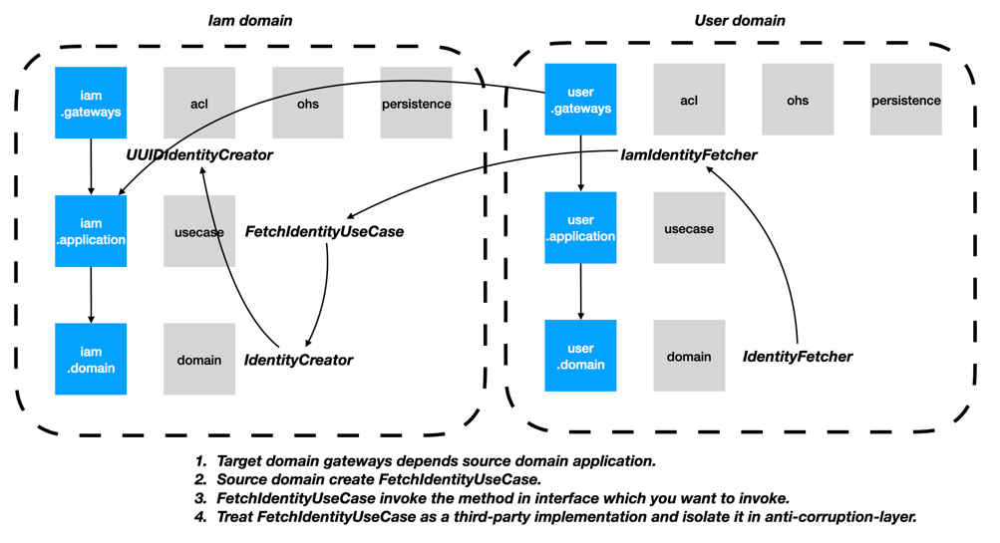

# QOMOLANGMA


## [English](./README.md) | [Chinese](./README.zh.md)

This repository contains all the materials you need to quickly build a new development environment.

## Environment preparation

### Environment dependencies

The development of this project relies on container technology and requires a Docker environment. If you have not
configured Docker environment, please configure Docker environment by yourself first. for Mac OS X and Windows, please
install Docker Desktop, for Linux system, please install Docker CE directly. the following information is for reference.

- Mac OS X: https://www.docker.com/products/docker-desktop
- Windows: https://www.docker.com/products/docker-desktop
- Ubuntu: https://docs.docker.com/engine/install/ubuntu/
- CentOS: https://docs.docker.com/engine/install/centos/

The frontend dependencies installation depends on npm and yarn. If you have not installed npm and yarn, please install
npm and yarn first.

### Development Platform

This project uses a mix of Java and Kotlin development, heavily dependent on the Java ecosystem. Please install OpenJDK
17 first.

- OpenJDK 17 for Windows:

  https://download.java.net/java/GA/jdk17.0.2/dfd4a8d0985749f896bed50d7138ee7f/8/GPL/openjdk-17.0.2_windows-x64_bin.zip
- OpenJDK 17 for Mac:

  https://download.java.net/java/GA/jdk18/43f95e8614114aeaa8e8a5fcf20a682d/36/GPL/openjdk-18_macos-x64_bin.tar.gz

- OpenJDK 17 for Linux:

  https://download.java.net/java/GA/jdk18/43f95e8614114aeaa8e8a5fcf20a682d/36/GPL/openjdk-18_linux-x64_bin.tar.gz

### Development Tools

For a better development experience and more efficient development, please use IntelliJ IDEA as the default development
tool: IntelliJ IDEA:

- IntelliJ IDEA: https://www.jetbrains.com/idea/

### Scripts

#### Dependency Services

All dependency services for this project can be built in an automated way. You will need to write your dependency
service deployment scripts. To build a completely new environment,
execute the following command in the project root directory.

```shell
sh ./scripts/setup-local
```

#### Install all frontend dependencies

```shell script
./gradlew npm_install
```

#### Code check before commit and push

In order to maintain the quality baseline and provide the necessary foundation for continuous integration, the project
provides the necessary infrastructure, one of which is the quality gatekeeper.

The quality gatekeeper provides various quality checks such as static code checks, unit tests, integration tests, test
coverage, front-end tests, etc.
**Developers must perform quality gatekeeper checks locally before each code push to the code repository**, and the
build server will also trigger quality gatekeeper after the code is pushed to the code repository. Execute quality
checks locally by directly executing the following commands.

```shell script
sh ./scripts/check-all
```

#### Run main project

```shell script
./gradlew bootRun
```

#### Run frontends

~~~shell script
./gradlew yarn_start
~~~

#### Build frontend dependencies

```shell script
./gradlew :qomolangma.webui:yarn_build
```

#### Listen to frontend tests

```shell script
./gradlew :qomolangma.webui:yarn_test
```

#### Build a docker image

```shell script
sh ./scripts/build-all
```

## Technical Architecture

In contrast to traditional development frameworks, we use a neat architecture as the guiding framework for our projects,
and implement Test Driven Development (TDD) + Domain Driven Design (DDD).

[https://medium.com/@matiasvarela/hexagonal-architecture-in-go-cfd4e436faa3](https://medium.com/@matiasvarela/hexagonal-architecture-in-go-cfd4e436faa3)

[https://blog.cleancoder.com/uncle-bob/2012/08/13/the-clean-architecture.html](https://blog.cleancoder.com/uncle-bob/2012/08/13/the-clean-architecture.html)


### Project directory architecture

#### home directory

~~~shell
. /src
~~~

### Core

~~~shell
. /frameworks
~~~

#### module

~~~shell
. /modules
~~~

#### scripts

~~~shell
. /scripts
~~~

#### frontend

~~~shell
. /frontends
~~~

### Test Driven Development (TDD)

Test Driven Development is the best way to develop high quality software, for more theory on TDD please refer yourself
to the web literature.
[https://en.wikipedia.org/wiki/Test-driven_development](https://en.wikipedia.org/wiki/Test-driven_development)

[https://www.oreilly.com/library/view/modern-c-programming/9781941222423/f_0055.html](https://www.oreilly.com/library/view/modern-c-programming/9781941222423/f_0055.html)

The project strictly follows the TDD principle. Since testing comes first, the business code should have relative
response tests for each kind of path, in this case, any uncovered code is redundant, so the project has extremely high
requirements for code coverage, and must ensure 100% code coverage.

#### Note

1. Integration testing should be done in `. /src/test/{kotlin:java}/... /usecases/{corresponding domain}/`.
2. Integration tests need to inherit from `IntegrationTest`, and if api is involved, it needs to inherit from `ApiTest`.
3. unit tests should be written in the corresponding module

### Domain Driven Design

Domain-driven design is the core solution for complex software. The project practices domain-driven design, and it is
recommended to develop in accordance with it.

#### model concept

##### domain

Core layer, no third-party dependencies allowed, only the cleanest business code is kept.

##### application

Use case layer, a scenario corresponds to a UseCase, UseCase only allows to call objects in the domain layer, by the
object to carry out its own corresponding behavior.

##### gateways

The gateway layer, where any third-party calls are implemented, is abstracted by the dependency inversion technique into
the interface of the domain layer.

#### Note

1. **Only the dependencies shown are allowed** (gateways depends on application depends on domain for the same domain,
   domain depends on core and gateways depends on application for different domains), any other dependencies are
   forbidden.
2. modules can depend on the corresponding frameworks domain.
3. **Prohibit the introduction of any third-party dependencies in the domain layer and application layer**, third-party
   dependencies are only allowed to be referenced in gateways, and dependencies are inverted using the Adaptor idea when
   the domain is used.
4. **Prohibit annotations**, methods are annotations, and the code corresponds to different tests that are different use
   cases.

#### Example

##### module



##### Simple call link



##### Call links for third-party dependencies



##### cross-domain



### Foundational capabilities of the framework

#### quality

#### Quality gating

#### engineering

#### multi-module

#### Continuous Integration, Continuous Deployment

#### Unified Dependency Versioning

~~~shell
. /gradle/libs.versions.toml
~~~

#### Database Version Control

#### Api documentation

Project integration with restdocs, api documentation needs to be maintained in the test

#### payload

Use payload as api context object to eliminate redundant, cumbersome Input, Output(vo, dto).

#### Uniform return and exception handling

#### internationalization

#### test containers

#### persistent layer testing

#### Mockito

#### Moco Server

#### Frontend Testing
